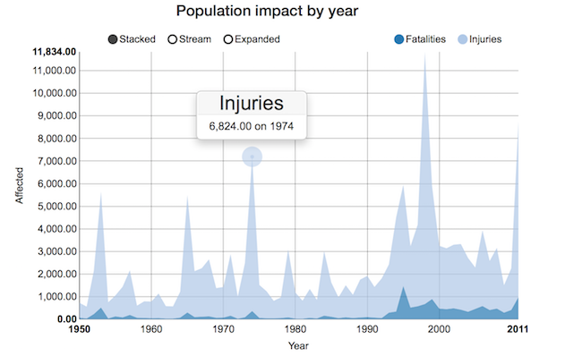

## Key stats (Between 1950 and 2011)
- 14834 deaths
- 139,445 injuries
- $358 billion worth of damage

--- .class1
## Impact of the storm 
- 1998 experienced maximum number of injuries attributed to 
- 1995 recorded the maximum number of fatalities in a year  - 1476
- 2005 recorded the maximum loss in terms of property damage - 96,750 million USD
- 1994 recorded the maximum loss resulting from crop damage - 5,806 million USD 

--- .class2
## Population impact

--- .class3
## Live demo
[Demo](https://abhixec.shinyapps.io/developing-data-products-shiny/)
-- .class4

## Thank You !

